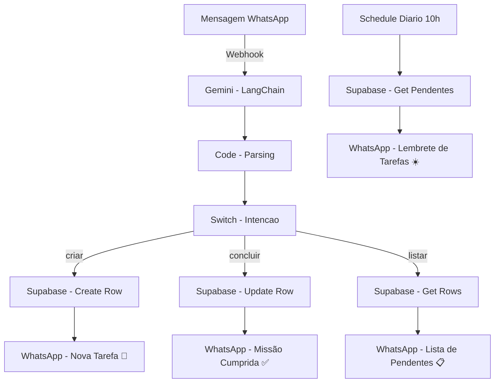

# 🧠 Agente de Tarefas — Automação com n8n, Supabase, Gemini e WhatsApp

Este projeto implementa um **agente inteligente de gerenciamento de tarefas** utilizando **n8n**, **Google Gemini**, **Supabase** e **Evolution API (WhatsApp)**.
O fluxo permite que o usuário **crie, conclua e consulte tarefas diretamente pelo WhatsApp**, usando linguagem natural.

---

## 🚀 Visão Geral

O **Agente de Tarefas** atua como um assistente pessoal conectado ao WhatsApp.
Ele entende mensagens como:

> “Preciso estudar n8n amanhã”
> “Terminei de estudar”
> “Listar tarefas pendentes”

E transforma essas instruções em ações automáticas no banco de dados, com respostas inteligentes e humanizadas.

Além disso, o agente envia **lembretes diários** com uma mensagem de “Bom dia” e a lista de tarefas pendentes de cada usuário.

---

## 🧩 Estrutura do Fluxo

### **1. Webhook**

Recebe mensagens do **WhatsApp via Evolution API** e inicia o fluxo com:

* ID do usuário (`remoteJid`)
* Mensagem de texto
* Metadados da conversa

---

### **2. Tradutor (Agente de IA)**

Nó baseado em **LangChain + Google Gemini**.
Responsável por interpretar a mensagem e gerar um JSON padronizado no formato:

```json
{
  "id_usuario": "5511999999999@whatsapp.net",
  "intencao": "criar | concluir | listar | indefinida",
  "descricao": "estudar n8n",
  "dataHora": "2025-10-07T15:00",
  "status": "pendente | concluída | "
}
```

---

### **3. Memory (Postgres Chat Memory)**

Mantém o histórico da conversa por usuário usando **PostgreSQL**, garantindo contexto em interações contínuas.

---

### **4. Code (Parsing & Normalização)**

Processa o output do modelo de IA, removendo erros de formatação e garantindo que a saída seja sempre JSON válido e consistente.

---

### **5. Switch (Decisor de Intenção)**

Controla o fluxo de acordo com a intenção detectada:

* 🟢 **criar:** adiciona uma nova tarefa no Supabase
* 🔵 **concluir:** atualiza o status para “concluída”
* 🟣 **listar:** retorna as tarefas pendentes
* ⚪ **indefinida:** ignora ou responde com instruções genéricas

---

### **6. Supabase (Banco de Dados)**

Usado para armazenar e consultar as tarefas dos usuários.
Tabela principal: `pendings`

| Campo    | Descrição                               |
| -------- | --------------------------------------- |
| `user`   | Identificador do usuário                |
| `task`   | Descrição da tarefa                     |
| `status` | Estado atual (`pendente` / `concluída`) |

---

### **7. Evolution API (Mensagens WhatsApp)**

Envia respostas personalizadas conforme a ação executada:

* ✳️ **Criação:** “Beleza! Nova missão adicionada 🚀”
* ✅ **Conclusão:** “Missão cumprida! 🚀”
* 📋 **Listagem:** “🎯 estudar n8n — amanhã às 15h”

---

### **8. Schedule Trigger (Lembretes Diários)**

Executa automaticamente **todos os dias às 10h**, busca as tarefas pendentes e envia uma mensagem motivacional personalizada.
Exemplos de mensagens:

> “Bom dia! ☀️ Que tal começar o dia com foco total?”
> “Bom dia! 💪 Mais um dia pra conquistar seus objetivos!”

Cada mensagem é gerada de forma aleatória para parecer mais natural e envolvente.

---

## 🗺️ Fluxo Simplificado




---

## ⚙️ Tecnologias Utilizadas

| Tecnologia           | Função                                |
| -------------------- | ------------------------------------- |
| 🧩 **n8n**           | Orquestração do fluxo de automação    |
| 🗄️ **Supabase**     | Banco de dados e API                  |
| 🤖 **Google Gemini** | Interpretação de linguagem natural    |
| 💬 **Evolution API** | Integração com WhatsApp               |
| 🧠 **LangChain**     | Framework de agentes de IA            |
| 🐘 **PostgreSQL**    | Armazenamento de contexto da conversa |

---

## 💬 Exemplos de Interação

| Mensagem do Usuário                 | Ação do Sistema      | Resposta                            |
| ----------------------------------- | -------------------- | ----------------------------------- |
| “Preciso estudar n8n amanhã às 15h” | Cria tarefa pendente | “Beleza! Nova missão adicionada 🚀” |
| “Terminei de estudar n8n”           | Marca como concluída | “Missão cumprida! 🚀”               |
| “Listar pendentes”                  | Lista tarefas        | “🎯 estudar n8n — amanhã às 15h”    |

---

## 🕓 Rotina Diária Automática

Todos os dias às **10h**, o sistema:

1. Busca todas as tarefas com status `pendente`
2. Agrupa por usuário
3. Envia mensagens personalizadas no WhatsApp com saudações e lista de tarefas

---

## 🧠 Objetivo

Demonstrar como combinar **IA, automação e banco de dados** para criar um agente de produtividade inteligente e interativo via WhatsApp.
Perfeito para estudos, projetos pessoais ou protótipos de assistentes conversacionais.

---

## 🧰 Requisitos

* Conta no **n8n**
* **Supabase** configurado com tabela `pendings`
* Credenciais válidas do **Evolution API** e **Google Gemini**
* Conexão com **PostgreSQL** (para memória do agente)

---

## 🧾 Licença

Distribuído sob a licença **MIT**.
Sinta-se à vontade para modificar, adaptar e expandir este projeto.

---

> 💡 **Dica:** Se quiser transformar este fluxo em um bot multiusuário completo, é possível integrar autenticação, categorias de tarefas e notificações customizadas via Supabase Functions.
